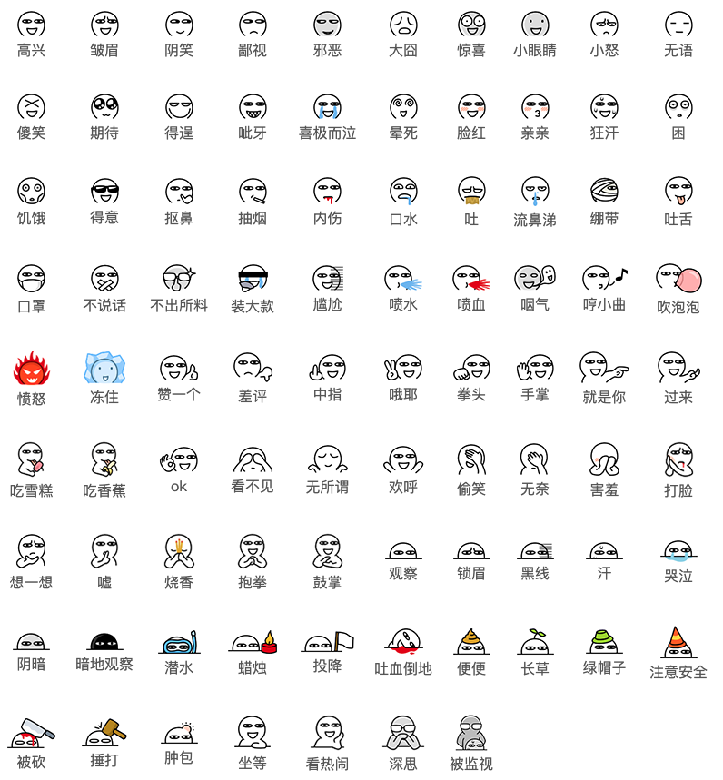

#  阿鲁表情
逛 [张大妈](https://www.smzdm.com/) 的时候发现了很多文章用到这个魔性的表情，能将作者丰富的情感表达出来。我也想在我的博客拥有这套表情包，便有了此插件。
## 接入说明
你可以下载本项目，引用 JS 和 CSS，通过固定的表情语法来使用表情。
```html
...
<link rel="stylesheet" href="path/src/css/alu.css">
...
<script src="path/src/js/alu.js"></script>
<script>
    // 你可以直接使用
    ALU();
    // 同时也可以传入参数进行配置
    // ALU({
    //     element: document.body,
    //     url: "https://res.smzdm.com/images/emotions/",
    //     addClass: "alu-face",
    //     mapping: {
    //         "高兴": "22.png",
    //         "皱眉": "23.png",
    //         "阴笑": "24.png",
    //         "鄙视": "25.png",
    //         "邪恶": "26.png",
    //         "大囧": "27.png",
    //         "惊喜": "28.png",
    //         "小眼睛": "29.png",
    //         "小怒": "30.png",
    //         "无语": "31.png",
    //         "傻笑": "32.png",
    //         "期待": "33.png",
    //         "得逞": "34.png",
    //         "呲牙": "35.png",
    //         "喜极而泣": "36.png",
    //         "晕死": "37.png",
    //         "脸红": "38.png",
    //         "亲亲": "39.png",
    //         "狂汗": "40.png",
    //         "困": "41.png",
    //         "饥饿": "42.png",
    //         "得意": "43.png",
    //         "抠鼻": "44.png",
    //         "抽烟": "45.png",
    //         "内伤": "46.png",
    //         "口水": "47.png",
    //         "吐": "48.png",
    //         "流鼻涕": "49.png",
    //         "绷带": "50.png",
    //         "吐舌": "51.png",
    //         "口罩": "52.png",
    //         "不说话": "53.png",
    //         "不出所料": "54.png",
    //         "装大款": "55.png",
    //         "尴尬": "56.png",
    //         "喷水": "57.png",
    //         "喷血": "58.png",
    //         "咽气": "59.png",
    //         "哼小曲": "60.png",
    //         "吹泡泡": "61.png",
    //         "愤怒": "62.png",
    //         "冻住": "63.png",
    //         "赞一个": "64.png",
    //         "差评": "65.png",
    //         "中指": "66.png",
    //         "哦耶": "67.png",
    //         "拳头": "68.png",
    //         "手掌": "69.png",
    //         "就是你": "70.png",
    //         "过来": "71.png",
    //         "吃雪糕": "72.png",
    //         "吃香蕉": "73.png",
    //         "ok": "74.png",
    //         "看不见": "75.png",
    //         "无所谓": "76.png",
    //         "欢呼": "77.png",
    //         "偷笑": "78.png",
    //         "无奈": "79.png",
    //         "害羞": "80.png",
    //         "打脸": "81.png",
    //         "想一想": "82.png",
    //         "嘘": "83.png",
    //         "烧香": "84.png",
    //         "抱拳": "85.png",
    //         "鼓掌": "86.png",
    //         "观察": "87.png",
    //         "锁眉": "88.png",
    //         "黑线": "89.png",
    //         "汗": "90.png",
    //         "哭泣": "91.png",
    //         "阴暗": "92.png",
    //         "暗地观察": "93.png",
    //         "潜水": "94.png",
    //         "蜡烛": "95.png",
    //         "投降": "96.png",
    //         "吐血倒地": "97.png",
    //         "便便": "98.png",
    //         "长草": "99.png",
    //         "绿帽子": "100.png",
    //         "注意安全": "101.png",
    //         "被砍": "102.png",
    //         "捶打": "103.png",
    //         "肿包": "104.png",
    //         "坐等": "105.png",
    //         "看热闹": "106.png",
    //         "深思": "107.png",
    //         "被监视": "108.png",
    //     },
    // });
</script>
```

## 参数说明
|  参数   | 必填  | 含义 | 默认值 |
|  ----  | ----  |  ----  | ----  |
| element  | 否 | 需要转换表情的标签 | `document.body` |
| url  | 否 | 表情链接地址，如果你使用本地地址请配置类似 `/path/img/` | `https://res.smzdm.com/images/emotions/` |
| addClass  | 否 | 表情添加的样式名用于控制样式 | `alu-face` |
| mapping | 否 | 表情映射关系，一般不需要改动 | {...} |

## 使用语法
在接入完成后，你可以使用特定的表情语法来使用表情。格式为 `[表情名]`，比如：`[高兴]`。
它将解释为：

## 表情列表


## 遇到困难
- 如果你在使用中有任何疑问，请点击 [Issues](https://github.com/isecret/alu/issues) 中查看或创建新的问题